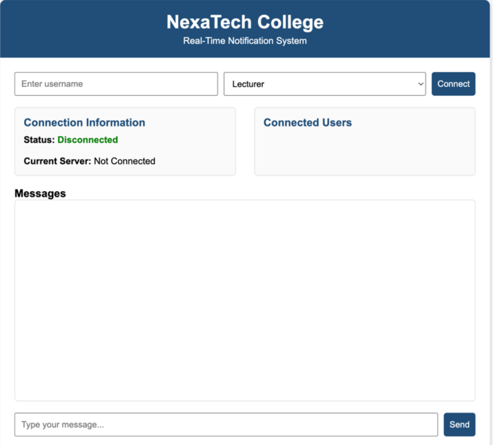
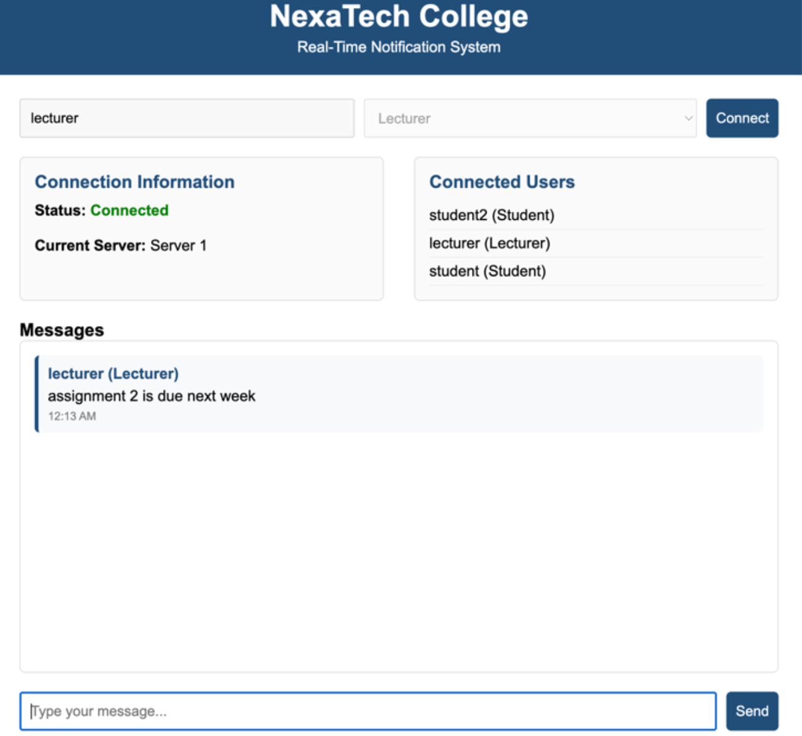
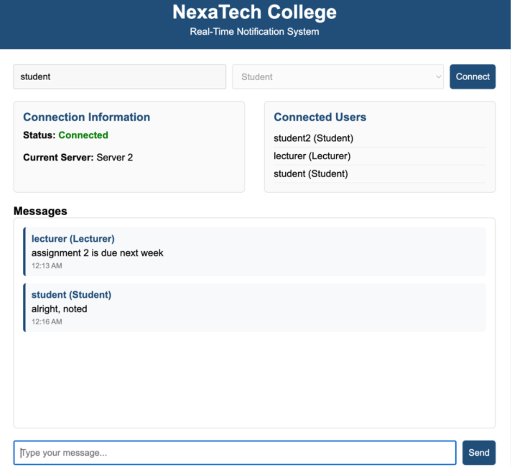
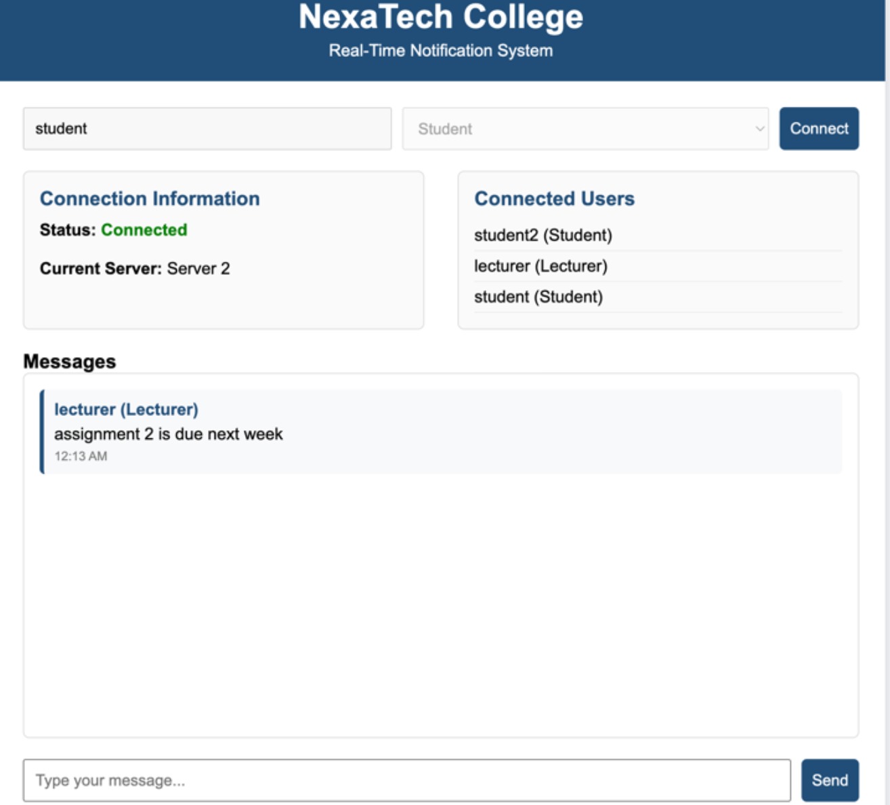

# Distributed Notification System

The Distributed Notification System is a real-time notification application developed using Node.js, Socket.IO, Redis, and Docker.

The system uses multiple servers and Redis Pub/Sub to distribute notifications between users connected to different server instances. It supports different user roles, including Lecturer and Student.

## Features

* Real-time notifications
* Lecturer and Student user roles
* Multi-server architecture
* Real-time communication using Socket.IO
* Redis Pub/Sub for communication between server instances
* Docker-based Redis server
* Notification broadcasting
* Multiple users connected simultaneously
* Server-to-server message distribution

## Technologies Used

* **Node.js** – Backend development
* **JavaScript** – Programming language
* **Socket.IO** – Real-time client-server communication
* **Redis** – Pub/Sub messaging
* **Docker** – Containerization
* **HTML/CSS/JavaScript** – Frontend interface

## System Architecture

The system uses multiple Node.js server instances connected through Redis Pub/Sub.

```text
                    ┌───────────────┐
                    │  Redis Server │
                    │   Pub / Sub   │
                    └───────┬───────┘
                            │
                ┌───────────┴───────────┐
                │                       │
        ┌───────▼────────┐     ┌────────▼───────┐
        │   Server 1     │     │    Server 2    │
        │   Port 3000    │     │    Port 3001   │
        └───────┬────────┘     └────────┬───────┘
                │                       │
        ┌───────▼────────┐     ┌────────▼───────┐
        │    Clients     │     │     Clients    │
        │ Lecturer/      │     │ Lecturer/      │
        │ Student        │     │ Student        │
        └────────────────┘     └────────────────┘
```

Redis Pub/Sub allows messages published through one server to be received by other connected server instances.

## User Roles

### Lecturer

Lecturers can send notifications to students through the system.

### Student

Students can receive real-time notifications from lecturers.

## How It Works

1. A user connects to one of the available Node.js servers.
2. Socket.IO establishes a real-time connection between the client and server.
3. When a notification is created, the server publishes the message through Redis.
4. Redis distributes the message to subscribed server instances.
5. The connected servers send the notification to their respective clients using Socket.IO.
6. Students receive the notification in real time.

## Screenshots

*Add screenshots of the application here.*

Example:









## Running the Project

### 1. Clone the repository

```bash
git clone <YOUR-GITHUB-REPOSITORY-URL>
```

### 2. Open the project folder

```bash
cd PADC_FP
```

### 3. Install dependencies

```bash
npm install
```

### 4. Start Redis using Docker

Make sure Docker is running, then start the Redis container:

```bash
docker start redis-server
```

If the Redis container has not been created yet, create it using the Redis Docker image configured for the project.

### 5. Start Server 1

Run the first Node.js server on port 3000.

### 6. Start Server 2

Run the second Node.js server on port 3001.

### 7. Open the application

Connect the clients to the appropriate server and test the notification system using the Lecturer and Student roles.

## Project Structure

```text
project/
├── server/
├── client/
├── public/
├── package.json
└── ...
```

## Key Concepts Demonstrated

This project demonstrates practical knowledge of:

* Distributed systems
* Client-server architecture
* Real-time communication
* Multi-server architecture
* Redis Pub/Sub
* WebSocket communication
* Docker containerization
* Concurrent client connections
* Event-driven programming

## Learning Outcomes

Through this project, I gained practical experience in:

* Developing real-time applications using Node.js and Socket.IO
* Working with Redis Pub/Sub
* Building multi-server applications
* Using Docker for service deployment
* Understanding distributed communication
* Managing different user roles
* Handling real-time events and notifications

## Future Improvements

Possible future improvements include:

* Persistent notification history
* User authentication
* Notification read/unread status
* Database integration
* Notification scheduling
* Improved error handling
* Deployment to a cloud environment

## Author

**Ameerah Solehah Bt Asban**

Diploma in Computer Science
Kolej Profesional MARA Beranang
